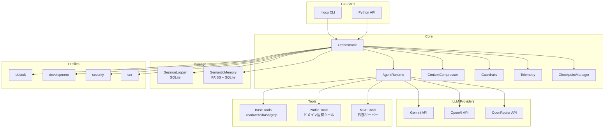

# MOCO

> **M**ulti-agent **O**rchestration **CO**re

[](https://www.python.org/)
[](LICENSE)

**マルチプロバイダ対応・プロファイルベースの軽量AIエージェントオーケストレーションフレームワーク**

MOCO は、複数のLLMプロバイダ（Gemini, OpenAI, OpenRouter, Z.ai）に対応し、ドメイン別のプロファイルで複数エージェントの振る舞いを柔軟にカスタマイズできるマルチエージェントオーケストレーションフレームワークです。

## ✨ 特徴

### 他のSDKとの差別化ポイント

| 機能 | moco | Claude Agent SDK | OpenAI Agents SDK |
|------|------|------------------|-------------------|
| **マルチプロバイダ** | ✅ Gemini/OpenAI/OpenRouter | ❌ Claude only | ❌ OpenAI only |
| **プロファイル機能** | ✅ YAML定義でドメイン別設定 | ❌ | ❌ |
| **セマンティックメモリ** | ✅ FAISS + 埋め込み検索 | ❌ | ❌ |
| **自動コンテキスト圧縮** | ✅ トークン上限時に自動要約 | ❌ | ❌ |
| **ガードレール** | ✅ 入力/出力/ツール検証 | ❌ | ✅ |
| **MCP対応** | ✅ Model Context Protocol | ✅ | ❌ |
| **チェックポイント** | ✅ 会話状態の保存/復元 | ❌ | ❌ |

### 主要機能

- **🔄 マルチプロバイダ対応**: Gemini, OpenAI, OpenRouter を環境変数またはCLIオプションで切り替え
- **📦 プロファイル機能**: ドメイン別（開発、セキュリティ、税務など）にエージェントとツールをパッケージ化
- **🧠 セマンティックメモリ**: FAISS による類似度検索で過去の知識・インシデントを自動想起
- **📝 自動コンテキスト圧縮**: トークン上限に近づくと古い会話を自動要約して圧縮
- **🛡️ ガードレール**: 危険なコマンドのブロック、入出力長制限、カスタムバリデーション
- **🔌 MCP対応**: Model Context Protocol で外部ツールサーバーと連携
- **💾 チェックポイント**: 会話状態を保存し、後から復元可能

## 📋 CLI コマンド一覧

### 基本コマンド

```bash
moco run "タスク"              # タスクを実行
moco chat                      # 対話型チャット
moco ui                        # Web UI を起動
moco version                   # バージョン表示
moco list-profiles             # プロファイル一覧
```

### Web UI

```bash
moco ui                        # http://0.0.0.0:8000 で起動
moco ui -p 3000                # ポート指定
moco ui -h 127.0.0.1           # ホスト指定
moco ui -r                     # 開発モード（自動リロード）
```

### タスク管理（バックグラウンド実行）

```bash
moco tasks run "タスク" --provider zai -w /path/to/project  # バックグラウンド実行
moco tasks list                # タスク一覧
moco tasks status              # リアルタイムダッシュボード
moco tasks logs <task_id>      # ログ表示
moco tasks cancel <task_id>    # キャンセル
```

### セッション管理

```bash
moco sessions list             # セッション一覧
moco sessions show <id>        # セッション詳細
moco run "続き" --continue     # 直前のセッションを継続
moco run "続き" -s my-session  # 名前付きセッションを継続
```

### スキル管理（Claude Skills互換）

```bash
moco skills list               # インストール済みスキル一覧
moco skills info               # 利用可能なレジストリ情報
moco skills sync anthropics    # 公式スキルを同期
moco skills sync community     # コミュニティスキルを同期
moco skills search pdf         # スキル検索
moco skills install <github>   # GitHubからインストール
moco skills uninstall <name>   # アンインストール
```

### オプション

```bash
--profile, -p <name>           # プロファイル指定
--provider <name>              # プロバイダ指定 (gemini/openai/openrouter/zai)
--provider <name/model>        # プロバイダ+モデル一括指定 (例: zai/glm-4.7)
--model, -m <name>             # モデル指定 (例: gpt-4o, gemini-2.5-pro, glm-4.7)
--working-dir, -w <path>       # 作業ディレクトリ
--sandbox                      # Dockerコンテナ内で隔離実行
--sandbox-image <image>        # サンドボックスイメージ (default: python:3.12-slim)
--stream/--no-stream           # ストリーミング出力
--verbose, -v                  # 詳細ログ
```

**プロバイダ指定例:**
```bash
moco run "タスク" --provider zai -m glm-4.7        # 別々に指定
moco run "タスク" --provider zai/glm-4.7          # 一括指定（推奨）
moco run "タスク" --provider openrouter -m claude-sonnet-4
```

## 🚀 クイックスタート

### インストール

```bash
# リポジトリをクローン
git clone https://github.com/moco-team/moco-agent.git
cd moco-agent

# 依存関係をインストール
pip install -e .

# または pipx で直接インストール
pipx install .
```

### 環境変数の設定

```bash
# .env ファイルを作成
cat << EOF > .env
# Gemini（デフォルト）
GENAI_API_KEY=your-gemini-api-key
GEMINI_API_KEY=your-gemini-api-key

# OpenAI（オプション）
OPENAI_API_KEY=your-openai-api-key

# OpenRouter（オプション）
OPENROUTER_API_KEY=your-openrouter-api-key
EOF
```

### 最初の実行

### 実行中の処理を停止する

- Web UI でチャットを実行中に表示される「停止」ボタンを押すと、そのセッションのストリーミングレスポンスが中断されます。
- バックエンドではセッションごとにキャンセル用のフラグを管理しており、「停止」ボタンは `POST /api/sessions/{session_id}/cancel` を呼び出してフラグを立てます。
- CLI についても同じキャンセル機構（`moco.cancellation` モジュール）を利用する想定ですが、現時点では Esc キーなどによる対話的な中断 UI は未実装です。

```bash
# タスクを実行
moco run "Hello, World! と表示するPythonスクリプトを作成して"

# プロファイルを指定
moco run "セキュリティ監査を実行" --profile security

# プロバイダを切り替え
moco run "コードをレビューして" --provider openai

# 対話モード
moco chat
```

## 🏗️ アーキテクチャ



### コンポーネント説明

| コンポーネント | 役割 |
|---------------|------|
| **Orchestrator** | メインエントリポイント。ユーザー入力をエージェントにルーティングし、サブエージェントへの委譲を管理 |
| **AgentRuntime** | 個々のエージェントの実行環境。LLM呼び出しとツール実行を担当 |
| **ContextCompressor** | トークン数監視と自動圧縮。古い会話をLLMで要約 |
| **Guardrails** | 入力/出力/ツール呼び出しの検証。危険パターンのブロック |
| **SessionLogger** | 会話履歴のSQLite永続化 |
| **SemanticMemory** | FAISS + Gemini Embeddingsによる類似度検索 |
| **CheckpointManager** | 会話状態のスナップショット保存/復元 |

## ⚙️ 設定

### 環境変数

| 変数名 | 説明 | デフォルト |
|--------|------|-----------|
| `GENAI_API_KEY` | Gemini API キー | - |
| `GEMINI_API_KEY` | Gemini API キー (後方互換) | - |
| `OPENAI_API_KEY` | OpenAI API キー | - |
| `OPENROUTER_API_KEY` | OpenRouter API キー | - |
| `ZAI_API_KEY` | Z.ai API キー | - |
| `LLM_PROVIDER` | デフォルトプロバイダ | `gemini` |
| `GEMINI_MODEL` | Gemini モデル名 | `gemini-3-flash-preview` |
| `OPENAI_MODEL` | OpenAI モデル名 | `gpt-5.1` |
| `OPENROUTER_MODEL` | OpenRouter モデル名 | `google/gemini-3-flash-preview` |
| `ZAI_MODEL` | Z.ai モデル名 | `glm-4.7` |
| `SEMANTIC_DB_PATH` | セマンティックメモリDB | `data/semantic.db` |

### プロファイル設定

プロファイルは `moco/profiles/<name>/` ディレクトリで定義します：

```
moco/profiles/my-profile/
├── profile.yaml      # プロファイル設定
├── agents/           # エージェント定義（Markdown）
│   ├── orchestrator.md
│   └── specialist.md
└── tools/            # プロファイル固有ツール（Python）
    └── custom_tool.py
```

#### profile.yaml

```yaml
name: my-profile
description: カスタムプロファイルの説明
include_base_tools: true  # ベースツールを含めるか
```

#### エージェント定義（Markdown）

```markdown
---
description: エージェントの説明
mode: primary  # primary または chat
tools:
  read_file: true
  write_file: true
  custom_tool: true
---

あなたは専門家エージェントです。
ユーザーの質問に答えてください。

現在時刻: {{CURRENT_DATETIME}}
```

## 🔧 ツール一覧

### ベースツール

| ツール名 | 説明 | エイリアス |
|----------|------|-----------|
| `read_file` | ファイルを読み込む | `read` |
| `write_file` | ファイルを書き込む | `write` |
| `edit_file` | ファイルを部分編集 | `edit` |
| `execute_bash` | Bashコマンドを実行 | `bash` |
| `list_dir` | ディレクトリ一覧 | - |
| `glob_search` | Globパターン検索 | - |
| `tree` | ディレクトリツリー表示 | - |
| `file_info` | ファイル情報取得 | - |
| `grep` | 正規表現検索 | - |
| `ripgrep` | 高速grep（rg） | - |
| `find_definition` | 定義を検索 | - |
| `find_references` | 参照を検索 | - |
| `codebase_search` | セマンティックコード検索 | - |
| `websearch` | Web検索 | - |
| `webfetch` | Webページ取得 | - |
| `todowrite` | TODOリスト書き込み | - |
| `todoread` | TODOリスト読み込み | - |

### Git ツール

| ツール名 | 説明 |
|----------|------|
| `git_status` | Git ステータス表示 |
| `git_diff` | 差分表示 |
| `git_commit` | AI生成コミットメッセージでコミット |
| `create_pr` | GitHub PR作成 |

### スキルツール

| ツール名 | 説明 |
|----------|------|
| `search_skills` | スキルを検索（ローカル + リモート） |
| `load_skill` | スキルをロードして知識を使用 |
| `list_loaded_skills` | ロード済みスキル一覧 |

### プロセス管理ツール

| ツール名 | 説明 |
|----------|------|
| `start_background` | バックグラウンドプロセス開始 |
| `stop_process` | プロセス停止 |
| `list_processes` | プロセス一覧 |
| `send_input` | プロセスに入力送信 |
| `wait_for_pattern` | 出力パターンを待機 |

### プロファイル固有ツール

各プロファイルは独自のツールを定義できます：

- **security**: `network_scan`, `cve_lookup`, `incident`, `threat_intel` など
- **tax**: `tax_calculator`, `tax_law_search`, `mortgage_calculator` など
- **development**: コード生成・レビュー用ツール

## 📖 使用例

### Python API

```python
from moco.core.orchestrator import Orchestrator
from moco.core.runtime import LLMProvider

# オーケストレーターの初期化
orchestrator = Orchestrator(
    profile="development",
    provider=LLMProvider.GEMINI,
    stream=True,
    verbose=False
)

# セッション作成
session_id = orchestrator.create_session(title="開発タスク")

# タスク実行
result = orchestrator.run_sync(
    "README.mdを作成してください",
    session_id=session_id
)
print(result)

# セッション継続
result = orchestrator.run_sync(
    "テストも追加して",
    session_id=session_id
)
```

### ガードレールの設定

```python
from moco.core.guardrails import Guardrails, GuardrailResult, GuardrailAction

# カスタムバリデーターを定義
def block_sensitive_data(text: str) -> GuardrailResult:
    if "password" in text.lower():
        return GuardrailResult(
            action=GuardrailAction.BLOCK,
            message="パスワード情報は出力できません"
        )
    return GuardrailResult(action=GuardrailAction.ALLOW)

# ガードレールを設定
guardrails = Guardrails(
    max_input_length=50000,
    max_tool_calls_per_turn=10,
    enable_dangerous_pattern_check=True
)
guardrails.add_output_validator(block_sensitive_data)

orchestrator = Orchestrator(
    profile="default",
    guardrails=guardrails
)
```

### MCP サーバーとの連携

```python
from moco.core.mcp_client import MCPClient, MCPConfig, MCPServerConfig

# MCP設定
mcp_config = MCPConfig(
    enabled=True,
    servers=[
        MCPServerConfig(
            name="filesystem",
            command="npx",
            args=["-y", "@anthropic/mcp-server-filesystem", "/path/to/dir"]
        )
    ]
)

# MCPクライアントを初期化
mcp_client = MCPClient(mcp_config)

# オーケストレーターに渡す
orchestrator = Orchestrator(
    profile="default",
    mcp_client=mcp_client
)
```

## 🗂️ ディレクトリ構造

```
moco/
├── cli.py                 # CLIエントリポイント
├── core/
│   ├── orchestrator.py    # メインオーケストレーター
│   ├── runtime.py         # エージェント実行環境
│   ├── context_compressor.py  # コンテキスト圧縮
│   ├── guardrails.py      # ガードレール
│   ├── checkpoint.py      # チェックポイント管理
│   ├── mcp_client.py      # MCPクライアント
│   └── telemetry.py       # テレメトリ
├── storage/
│   ├── session_logger.py  # セッション管理
│   └── semantic_memory.py # セマンティックメモリ
├── tools/
│   ├── base.py            # 基本ツール
│   ├── filesystem.py      # ファイルシステム操作
│   ├── search.py          # 検索ツール
│   ├── web.py             # Web関連ツール
│   └── discovery.py       # ツール/エージェント検出
├── profiles/
│   ├── default/           # デフォルトプロファイル
│   ├── development/       # 開発プロファイル
│   ├── security/          # セキュリティプロファイル
│   └── tax/               # 税務プロファイル
└── ui/
    ├── console.py         # コンソールUI
    └── theme.py           # テーマ設定
```

## 🧪 開発

### 開発環境のセットアップ

```bash
# 開発用依存関係をインストール
pip install -e ".[dev]"

# テスト実行
pytest

# 型チェック
mypy moco/

# リンター
ruff check moco/
```

### 新しいプロファイルの作成

```bash
# プロファイルディレクトリを作成
mkdir -p moco/profiles/my-profile/{agents,tools}

# profile.yaml を作成
cat << EOF > moco/profiles/my-profile/profile.yaml
name: my-profile
description: 私のカスタムプロファイル
include_base_tools: true
EOF

# orchestrator.md を作成
cat << EOF > moco/profiles/my-profile/agents/orchestrator.md
---
description: カスタムオーケストレーター
mode: primary
tools:
  read_file: true
  write_file: true
---

あなたはカスタムエージェントです。
EOF

# 使用
moco run "タスク" --profile my-profile
```

## 📄 ライセンス

MIT License

Copyright (c) 2024-2026 Moco Team

Permission is hereby granted, free of charge, to any person obtaining a copy
of this software and associated documentation files (the "Software"), to deal
in the Software without restriction, including without limitation the rights
to use, copy, modify, merge, publish, distribute, sublicense, and/or sell
copies of the Software, and to permit persons to whom the Software is
furnished to do so, subject to the following conditions:

The above copyright notice and this permission notice shall be included in all
copies or substantial portions of the Software.

THE SOFTWARE IS PROVIDED "AS IS", WITHOUT WARRANTY OF ANY KIND, EXPRESS OR
IMPLIED, INCLUDING BUT NOT LIMITED TO THE WARRANTIES OF MERCHANTABILITY,
FITNESS FOR A PARTICULAR PURPOSE AND NONINFRINGEMENT. IN NO EVENT SHALL THE
AUTHORS OR COPYRIGHT HOLDERS BE LIABLE FOR ANY CLAIM, DAMAGES OR OTHER
LIABILITY, WHETHER IN AN ACTION OF CONTRACT, TORT OR OTHERWISE, ARISING FROM,
OUT OF OR IN CONNECTION WITH THE SOFTWARE OR THE USE OR OTHER DEALINGS IN THE
SOFTWARE.
