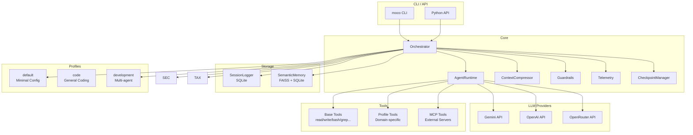

<div align="center">
  <video src="docs/assets/moco-intro.mp4" width="100%" autoplay loop muted playsinline></video>
</div>

> **M**ulti-agent **O**rchestration **CO**re

[](https://github.com/moco-ai/moco)
[](https://www.python.org/)
[](LICENSE)
[](https://github.com/moco-ai/moco/issues)
[](https://github.com/moco-ai/moco/releases)

**Multi-provider, profile-based lightweight AI agent orchestration framework**

MOCO is an orchestration framework that supports multiple LLM providers (Gemini, OpenAI, OpenRouter, Z.ai) and allows flexible customization of multi-agent behaviors through domain-specific profiles.

## ✨ Features

### Core Features
- **🔄 Multi-provider Support**: Switch between Gemini, OpenAI, OpenRouter, and Z.ai via environment variables or CLI options.
- **📦 Profile-based Configuration**: Define agents and tools for specific domains (development, security, tax, etc.) using YAML.
- **🤖 Multi-agent Orchestration**: Coordinate multiple agents to execute tasks with delegation and review workflows.
- **🧠 Semantic Memory**: Automatically recall past knowledge and incidents using FAISS-based similarity search.
- **📚 Learning Memory**: Automatically extract and store knowledge from conversations for use in subsequent interactions.
- **📝 Automatic Context Compression**: Automatically summarizes and compresses older conversation history when approaching token limits.

### CLI & UI
- **💻 Rich CLI**: Execute tasks immediately from the terminal with `moco run` and `moco chat`.
- **🌐 Web UI**: Launch a browser-based chat interface with `moco ui`.
- **📊 Task Management**: Run tasks in the background, monitor progress, and view logs.
- **📁 Session Management**: Persistent storage, recovery, and named sessions for conversation history.
- **💰 Cost Management**: Track token usage and estimated costs directly from the CLI with `/cost`.

### Mobile Integration
- **📱 WhatsApp Integration**: Chat with moco agents via WhatsApp (supports text, images, and documents).
- **📸 Vision Capability**: Automatically recognizes sent images for multi-modal interactions.
- **⌨️ Mobile Commands**: Slash commands like `/profile`, `/cd`, and `/workdir` available from mobile.

### Developer-focused
- **🔍 Codebase Search**: Understand your codebase via semantic search powered by FAISS.
- **🔧 Git Integration**: Generate AI commit messages and create Pull Requests.
- **🛡️ Sandbox**: Isolated execution within Docker containers.
- **🔌 MCP Support**: Integrate with external tool servers via the Model Context Protocol.
- **📚 Skill Management**: Install and manage Claude Skills compatible packages.

### Safety & Reliability
- **🛡️ Guardrails**: Block dangerous commands and enforce input/output length limits.
- **🔒 Loop Detection**: Automatically detect and stop infinite tool-calling loops.
- **💾 Checkpoints**: Save conversation states and restore them later.

## CLI Commands

### Basic Commands

```bash
moco run "task"                # Execute a task
moco chat                      # Interactive chat (streaming)
moco chat -s my-session        # Chat with a named session
moco chat --new                # Force start a new session
moco ui                        # Start the Web UI
moco version                   # Show version
moco list-profiles             # List available profiles
```

### In-Chat Commands (Slash Commands)

Enter `/` during a chat session to access various operations:

*   `/help`: Show command help
*   `/cd <path|bookmark>`: Change working directory
*   `/workdir <add|list|remove> [name]`: Manage directory bookmarks
*   `/ls [path]`: List files
*   `/tree [depth]`: Show directory structure
*   `/model [model_name]`: View or change the current model
*   `/profile [profile_name]`: Change the current profile
*   `/cost [today|all]`: Show token usage and estimated cost
*   `/clear`: Clear history and restart the session
*   `/quit`: Exit the chat

### Web UI

```bash
moco ui                        # Available at http://0.0.0.0:8000
moco ui -p 3000                # Specify port
moco ui -h 127.0.0.1           # Specify host
moco ui -r                     # Development mode (auto-reload)
```

### Task Management (Background Execution)

```bash
moco tasks run "task" -P zai -w /path/to/project  # Run in background
moco tasks list                # List all tasks
moco tasks status              # Real-time dashboard
moco tasks logs <task_id>      # Show logs (max 10KB)
moco tasks logs <task_id> -a   # Show full logs (--all)
moco tasks cancel <task_id>    # Cancel a task
```

### Session Management

```bash
moco sessions list             # List all sessions
moco sessions show <id>        # Show session details
moco run "continue" --continue # Continue the last session
moco run "continue" -s my-session # Continue a named session
```

### Skill Management (Claude Skills Compatible)

```bash
moco skills list               # List installed skills
moco skills info               # Show available registry info
moco skills sync anthropics    # Sync official skills
moco skills sync community     # Sync community skills
moco skills search pdf         # Search for skills
moco skills install <github>   # Install from GitHub
moco skills uninstall <name>   # Uninstall a skill
```

### Options

```bash
--profile, -p <name>           # Specify profile
--provider, -P <name>          # Specify provider (gemini/openai/openrouter/zai)
--provider, -P <name/model>    # Specify provider + model (e.g., zai/glm-4.7)
--model, -m <name>             # Specify model (e.g., gpt-4o, gemini-2.0-flash, glm-4.7)
--working-dir, -w <path>       # Set working directory
--session, -s <name>           # Specify named session
--continue, -c                 # Continue last session
--new                          # Force start a new session
--sandbox                      # Run inside an isolated Docker container
--sandbox-image <image>        # Sandbox image (default: python:3.12-slim)
--stream/--no-stream           # Enable/disable streaming output (default: ON for chat)
--optimizer/--no-optimizer     # Auto-select agents using Optimizer (default: OFF)
--verbose, -v                  # Verbose logging
```

**Provider Specification Examples:**
```bash
moco run "task" --provider zai -m glm-4.7      # Specify separately
moco run "task" --provider zai/glm-4.7        # Combined (recommended)
moco run "task" --provider openrouter -m claude-3-5-sonnet
```

## 📱 Mobile Integration (WhatsApp)

MOCO can be integrated with WhatsApp, allowing you to interact with your AI agents directly from your mobile device.

### Setup

```bash
# Install mobile dependencies
pip install -e ".[mobile]"

# Start the Web UI server
moco ui &

# Start the WhatsApp client
python -m moco.gateway.clients.whatsapp &
```

### First-time Connection

1. A QR code will be displayed in the terminal
2. Open WhatsApp on your phone
3. Go to **Settings** → **Linked Devices** → **Link a Device**
4. Scan the QR code

### Usage

Send messages to **yourself** in WhatsApp (Note to Self / Saved Messages):

```
Hello, create a Python script
```

MOCO will process your request and reply with the result.

### Available Commands

| Command | Description |
|---------|-------------|
| `/stop` | Cancel the current running task |
| `/new` or `/clear` | Start a new session |
| `/profile <name>` | Change profile (e.g., `development`, `code`) |
| `/provider <name>` | Change LLM provider (e.g., `openai`, `gemini`) |
| `/workdir <path>` | Change working directory |
| `/cd <path>` | Alias for `/workdir` |
| `/status` | Show current settings |
| `/help` | Show help message |

### Important Notes

- **Self-messages only**: MOCO only responds to messages you send to yourself, not to messages from other contacts or groups
- **Privacy**: Your conversations stay between you and the MOCO server running on your machine
- **Long tasks**: For long-running tasks, use `/stop` to cancel and continue with a new request

### Example Workflow

```
You: /workdir ~/projects/myapp
MOCO: ✅ Working directory changed: /home/user/projects/myapp

You: Create a FastAPI hello world app
MOCO: [Creates main.py with FastAPI code]

You: /stop
MOCO: 🛑 Execution cancelled

You: Now add a /users endpoint
MOCO: [Continues with the new request]
```

## 🚀 Quick Start

### Installation

```bash
# Clone the repository
git clone https://github.com/moco-ai/moco.git
cd moco

# Install dependencies
pip install -e .

# Or install directly via pipx
pipx install .
```

### Environment Variables

```bash
# Create a .env file
cat << EOF > .env
# Gemini (Default)
GEMINI_API_KEY=your-gemini-api-key

# OpenAI (Optional)
OPENAI_API_KEY=your-openai-api-key

# OpenRouter (Optional)
OPENROUTER_API_KEY=your-openrouter-api-key

# Z.ai (Optional)
ZAI_API_KEY=your-zai-api-key
EOF
```

### First Run

### Stopping Running Processes

- Clicking the "Stop" button in the Web UI interrupts the streaming response for that session.
- The backend manages cancellation flags per session. The "Stop" button triggers `POST /api/sessions/{session_id}/cancel` to set this flag.
- The same cancellation mechanism (`moco.cancellation` module) is planned for the CLI, though an interactive UI (like an Esc key bind) is currently pending.

```bash
# Run a task
moco run "Create a Python script that prints 'Hello, World!'"

# Specify a profile
moco run "Perform a security audit" --profile security

# Switch providers
moco run "Review the code" --provider openai

# Interactive mode
moco chat
```

## 🏗️ Architecture



### Component Breakdown

| Component | Role |
|-----------|------|
| **Orchestrator** | Main entry point. Routes user input to agents and manages delegation to sub-agents. |
| **AgentRuntime** | Execution environment for individual agents. Handles LLM calls and tool execution. |
| **ContextCompressor** | Monitors token count and automatically summarizes old conversation history using LLM. |
| **Guardrails** | Validates input/output and tool calls. Blocks dangerous patterns. |
| **SessionLogger** | Persists conversation history in SQLite. |
| **SemanticMemory** | Performs similarity search using FAISS + Gemini Embeddings. |
| **CheckpointManager** | Saves and restores snapshots of conversation states. |

## ⚙️ Configuration

### Environment Variables

| Variable | Description | Default |
|----------|-------------|---------|
| `GENAI_API_KEY` | Gemini API Key | - |
| `GEMINI_API_KEY` | Gemini API Key (Backward Compatibility) | - |
| `OPENAI_API_KEY` | OpenAI API Key | - |
| `OPENROUTER_API_KEY` | OpenRouter API Key | - |
| `ZAI_API_KEY` | Z.ai API Key | - |
| `MOCO_DEFAULT_PROVIDER` | Force a default provider | Auto-select |
| `GEMINI_MODEL` | Gemini Model Name | `gemini-2.0-flash` |
| `OPENAI_MODEL` | OpenAI Model Name | `gpt-4o` |
| `OPENROUTER_MODEL` | OpenRouter Model Name | `google/gemini-2.0-flash-001` |
| `ZAI_MODEL` | Z.ai Model Name | `glm-4.7` |
| `SEMANTIC_DB_PATH` | Path to Semantic Memory DB | `data/semantic.db` |
| `MEMORY_DB_PATH` | Path to Learning Memory DB | `src/moco/data/memory.db` |

**Auto-selection Priority**: Based on configured API keys, providers are automatically selected in the following order: `zai` → `openrouter` → `gemini`.

### Profile Configuration

Profiles are defined in the `moco/profiles/<name>/` directory:

```
moco/profiles/my-profile/
├── profile.yaml      # Profile settings
├── agents/           # Agent definitions (Markdown)
│   ├── orchestrator.md
│   └── specialist.md
├── tools/            # Profile-specific tools (Python)
│   └── custom_tool.py
└── skills/           # Skill definitions (Claude Skills compatible)
    └── my-skill/
        └── skill.md
```

### Built-in Profiles

| Profile | Agent Count | Description |
|---------|:-----------:|-------------|
| **default** | 1 | Minimal configuration for simple tasks. |
| **code** | 2 | General coding. Includes orchestrator and code-reviewer. |
| **development** | 14 | Multi-agent development team (see table below). |

#### Agents in the `development` Profile

| Agent | Role |
|-------|------|
| orchestrator | Task distribution and overall management. |
| backend-coder | Backend implementation (Python, Node.js, Go, etc.). |
| frontend-coder | Frontend implementation (React, Vue, Angular, etc.). |
| code-reviewer | Code review and quality checks. |
| architect | Architectural design. |
| api-designer | API design (REST, GraphQL). |
| schema-designer | Database schema design. |
| unit-tester | Creating unit tests. |
| integration-tester | Creating integration tests. |
| test-strategist | Formulating testing strategies. |
| security-reviewer | Security reviews. |
| performance-reviewer | Performance reviews. |
| refactorer | Refactoring. |
| doc-writer | Documentation generation. |

```bash
# List available profiles
moco list-profiles

# Usage examples
moco run "Implement an API" --profile development
moco chat --profile code
```

### Agent Organization Patterns

Using the `delegate_to_agent` tool, you can implement various organizational structures.

#### 1. Hierarchical

The most fundamental pattern. The Orchestrator delegates tasks to sub-agents.

```
orchestrator
├── @backend-coder  → Backend implementation
├── @frontend-coder → Frontend implementation
└── @code-reviewer  → Code review
```

```python
# Example in orchestrator.md
delegate_to_agent(agent_name="backend-coder", task="Implement the API")
```

#### 2. Multi-level Hierarchy

Sub-agents can delegate to their own sub-agents.

```
orchestrator
└── @chief-architect
    ├── @architect-team-a → Team A design
    └── @architect-team-b → Team B design
```

```yaml
# chief-architect.md
tools:
  - delegate_to_agent  # Grant delegation authority to the sub-agent
```

#### 3. Parallel

Multiple agents work independently and simultaneously.

```markdown
# Mention multiple @agents simultaneously in orchestrator.md
@backend-coder Implement the API
@frontend-coder Implement the UI
@unit-tester Create tests
```

MOCO automatically executes these in parallel and aggregates the results.

#### 4. Sequential (Pipeline)

A chain where output from one agent is passed to the next.

```
@api-designer → @backend-coder → @unit-tester → @code-reviewer
```

```markdown
# Workflow in orchestrator.md
1. Request @api-designer for API design
2. Pass the design to @backend-coder for implementation
3. Pass implementation to @unit-tester for test creation
4. Pass everything to @code-reviewer for final review
```

#### 5. Peer Review

Sub-agents review each other's work.

```yaml
# backend-coder.md
tools:
  - delegate_to_agent

# Inside prompt
After implementation, request @frontend-coder to review the API integration.
```

#### 6. Consensus

Multiple specialists discuss and derive the optimal solution.

```markdown
# orchestrator.md
Gather opinions from specialists for a final decision:
@security-reviewer Security perspective
@performance-reviewer Performance perspective
@architect Design perspective

Synthesize the three opinions into a final decision.
```

#### 7. Competition

Try multiple approaches simultaneously and select the best one.

```markdown
# orchestrator.md
Implement using three different approaches:
@approach-simple Simple implementation
@approach-perf Performance-focused
@approach-flex Extensibility-focused

Compare results and adopt the best implementation.
```

#### profile.yaml

```yaml
name: my-profile
description: Description of your custom profile
include_base_tools: true  # Whether to include base tools
```

#### Agent Definition (Markdown)

```markdown
---
description: Description of the agent
mode: primary  # primary or chat
tools:
  read_file: true
  write_file: true
  custom_tool: true
---

You are an expert agent.
Please answer user questions.

Current time: {{CURRENT_DATETIME}}
```

## 🔧 Tools

### Base Tools

| Tool | Role | Alias |
|------|------|-------|
| `read_file` | Read file content | `read` |
| `write_file` | Write to a file | `write` |
| `edit_file` | Partially edit a file | `edit` |
| `execute_bash` | Execute Bash commands | `bash` |
| `list_dir` | List directory contents | - |
| `glob_search` | Search via Glob patterns | - |
| `tree` | Show directory tree | - |
| `file_info` | Get file metadata | - |
| `grep` | Regular expression search | - |
| `ripgrep` | Fast grep (rg) | - |
| `find_definition` | Find definitions in code | - |
| `find_references` | Find code references | - |
| `codebase_search` | Semantic codebase search | - |
| `websearch` | Web search | - |
| `webfetch` | Fetch web page content | - |
| `todowrite` | Write to TODO list | - |
| `todoread` | Read TODO list | - |

### Git Tools

| Tool | Role |
|------|------|
| `git_status` | Show Git status |
| `git_diff` | Show diffs |
| `git_commit` | Commit with AI-generated message |
| `create_pr` | Create a GitHub Pull Request |

### Skill Tools

| Tool | Role |
|------|------|
| `search_skills` | Search skills (local + remote) |
| `load_skill` | Load a skill to use its knowledge |
| `list_loaded_skills` | List currently loaded skills |

### Process Management Tools

| Tool | Role |
|------|------|
| `start_background` | Start a background process |
| `stop_process` | Stop a process |
| `list_processes` | List active processes |
| `send_input` | Send input to a process |
| `wait_for_pattern` | Wait for an output pattern |

### Profile-specific Tools

Each profile can define its own tools:

- **security**: `network_scan`, `cve_lookup`, `incident`, `threat_intel`, etc.
- **tax**: `tax_calculator`, `tax_law_search`, `mortgage_calculator`, etc.
- **development**: Tools for code generation and review.

## 📖 Usage Examples

### Python API

```python
from moco.core.orchestrator import Orchestrator
from moco.core.runtime import LLMProvider

# Initialize Orchestrator
orchestrator = Orchestrator(
    profile="development",
    provider=LLMProvider.GEMINI,
    stream=True,
    verbose=False
)

# Create a session
session_id = orchestrator.create_session(title="Dev Task")

# Execute a task
result = orchestrator.run_sync(
    "Generate a README.md file",
    session_id=session_id
)
print(result)

# Continue session
result = orchestrator.run_sync(
    "Now add some tests",
    session_id=session_id
)
```

### Guardrail Configuration

```python
from moco.core.guardrails import Guardrails, GuardrailResult, GuardrailAction

# Define a custom validator
def block_sensitive_data(text: str) -> GuardrailResult:
    if "password" in text.lower():
        return GuardrailResult(
            action=GuardrailAction.BLOCK,
            message="Sensitive password info cannot be exported."
        )
    return GuardrailResult(action=GuardrailAction.ALLOW)

# Configure guardrails
guardrails = Guardrails(
    max_input_length=50000,
    max_tool_calls_per_turn=10,
    enable_dangerous_pattern_check=True
)
guardrails.add_output_validator(block_sensitive_data)

orchestrator = Orchestrator(
    profile="default",
    guardrails=guardrails
)
```

### MCP Server Integration

```python
from moco.core.mcp_client import MCPClient, MCPConfig, MCPServerConfig

# MCP configuration
mcp_config = MCPConfig(
    enabled=True,
    servers=[
        MCPServerConfig(
            name="filesystem",
            command="npx",
            args=["-y", "@anthropic/mcp-server-filesystem", "/path/to/dir"]
        )
    ]
)

# Initialize MCP Client
mcp_client = MCPClient(mcp_config)

# Pass to Orchestrator
orchestrator = Orchestrator(
    profile="default",
    mcp_client=mcp_client
)
```

## 🗂️ Directory Structure

```
moco/
├── cli.py                 # CLI entry point
├── core/
│   ├── orchestrator.py    # Main orchestrator
│   ├── runtime.py         # Agent runtime environment
│   ├── context_compressor.py  # Context compression
│   ├── guardrails.py      # Guardrails
│   ├── checkpoint.py      # Checkpoint management
│   ├── mcp_client.py      # MCP client
│   └── telemetry.py       # Telemetry
├── storage/
│   ├── session_logger.py  # Session management
│   └── semantic_memory.py # Semantic memory
├── tools/
│   ├── base.py            # Base tools
│   ├── filesystem.py      # Filesystem operations
│   ├── search.py          # Search tools
│   ├── web.py             # Web-related tools
│   └── discovery.py       # Tool/Agent discovery
├── profiles/
│   ├── default/           # Minimal config (1 agent)
│   ├── code/              # General coding (2 agents)
│   └── development/       # Multi-agent development team (14 agents)
└── ui/
    ├── console.py         # Console UI
    └── theme.py           # Theme settings
```

## 🧪 Development

### Development Setup

```bash
# Install development dependencies
pip install -e ".[dev]"

# Run tests
pytest

# Type checks
mypy moco/

# Linter
ruff check moco/
```

### Creating a New Profile

```bash
# Create profile directory
mkdir -p moco/profiles/my-profile/{agents,tools,skills}

# Create profile.yaml
cat << EOF > moco/profiles/my-profile/profile.yaml
name: my-profile
description: My custom profile
include_base_tools: true
EOF

# Create orchestrator.md
cat << EOF > moco/profiles/my-profile/agents/orchestrator.md
---
description: Custom Orchestrator
mode: primary
tools:
  read_file: true
  write_file: true
---

You are a custom agent.
EOF

# Usage
moco run "task" --profile my-profile
```

## 🧠 Learning Memory

MOCO automatically learns knowledge from conversations and applies it to future interactions.

### Feature Overview

| Feature | Description |
|---------|-------------|
| **recall** | Searches relevant memories before prompting (hybrid search: embedding + keyword). |
| **learn** | Extracts and stores knowledge from conversations (with duplication/contradiction checks). |
| **record_task_run_event** | Logs tool executions. |

### Example Usage

```bash
# Provide information
moco run "Ask Tanaka-san about expense reports."

# Later, when you ask a question, it uses the learned knowledge
moco run "Who should I ask about expense reports?"
# -> Response: "You should ask Tanaka-san."
```

### Database

Knowledge is stored in SQLite (default: `src/moco/data/memory.db`).

```bash
# Check memories
sqlite3 src/moco/data/memory.db "SELECT content FROM memories"

# Check tool execution logs
sqlite3 src/moco/data/memory.db "SELECT tool_name, success FROM task_run_events"
```

### Table Structure

- **memories**: Learned knowledge (content, type, keywords, embedding).
- **task_run_events**: Tool execution logs (run_id, tool_name, params, result, success).
- **relations**: Relationships between entities (for NetworkX integration, optional).

## 📄 License

MIT License

Copyright (c) 2024-2026 Moco Team

Permission is hereby granted, free of charge, to any person obtaining a copy
of this software and associated documentation files (the "Software"), to deal
in the Software without restriction, including without limitation the rights
to use, copy, modify, merge, publish, distribute, sublicense, and/or sell
copies of the Software, and to permit persons to whom the Software is
furnished to do so, subject to the following conditions:

The above copyright notice and this permission notice shall be included in all
copies or substantial portions of the Software.

THE SOFTWARE IS PROVIDED "AS IS", WITHOUT WARRANTY OF ANY KIND, EXPRESS OR
IMPLIED, INCLUDING BUT NOT LIMITED TO THE WARRANTIES OF MERCHANTABILITY,
FITNESS FOR A PARTICULAR PURPOSE AND NONINFRINGEMENT. IN NO EVENT SHALL THE
AUTHORS OR COPYRIGHT HOLDERS BE LIABLE FOR ANY CLAIM, DAMAGES OR OTHER
LIABILITY, WHETHER IN AN ACTION OF CONTRACT, TORT OR OTHERWISE, ARISING FROM,
OUT OF OR IN CONNECTION WITH THE SOFTWARE OR THE USE OR OTHER DEALINGS IN THE
SOFTWARE.
